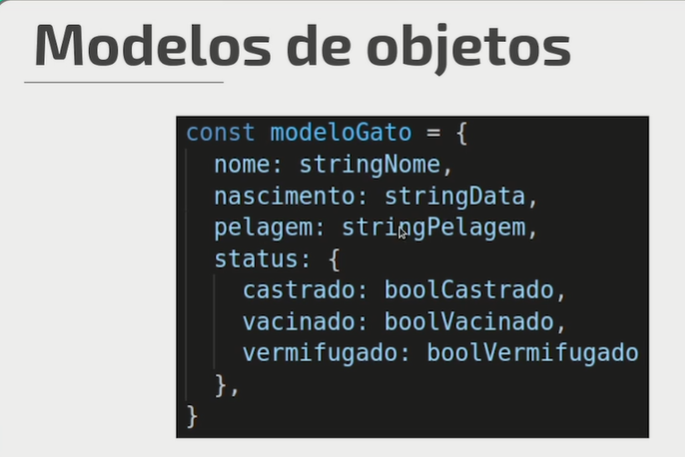

# Programação Orientada a Objetos - JavaScript

## Paradigmas

 São abordagens sobre como resolver problemas de programaçao

Baseadas em teoria ou conjunto de principios definidos

Alguns paradigmas

- Imperativo

  - São aqueles que usam afirmações para alter o estado de um programa
  - Se preocupa com o "Como" uma tarefa vai ser executada, seu passo a apasso e a sequencia dessas etapas
    - Estrutural
    - Procedural
    - Orientadado a Objetos
  - ex:

  ```js
  function dobra(vetor){
      let resultados = [];
      for (let i = 0; i < vetor.length ; i++){
          resultados.push(vetor[i] * 2);
  }
  return resultados;
  }
  ```
- Relacional
- Declarativo

  - Expressa lógica e um processo sem descrever o seu controle de fluxo
  - Associado ao "o quê" uma tarefa vai resultar ou retornar
    - Funcional
  - ex:

  ```js
  function dobra(vetor){
  return vetor.map((item) => item * 2);
  }
  ```

O JS e algumas outras linguagem podem utilizar mais de um paradigma

O termo Multiparadigma se encaixa e essa natureza traz alguns beneficios

    permite perfis diferentes de desenvolvedores e sistemas utilizarem uma linguagem em comum

Cada paradigma depende de uma circunstancia para ser usado, algumas funcionalidades precisam alterar o estado de uma aplicação, nao podendo ser escritas de forma declaratival por exemplo

## Orientação a Objetos

É o principio de espelhar o mundo real através de uma estrutura de objetos com Características e ações que interagem uns com os outros.

Ela parte da premissa de aproximar a modelagem dos projetos, códigos, produto com o mundo real

Tem uma estrutura geral, chamada de CLASSE

- Um modelo para a criação de objetos
- Ex:
- Gato:
  - caracteristicas
    - sexo;
    - idade
    - pelage
    - status
      - castrado
      - vacidade
      - vermifugado
  - comportamentos
    - miar
    - comer
    - dormir
    - limpar
    - brincar
      - bolinha
      - laser

---

Métodos

- Funções que são executadas no contexto de um Objeto

## Modelos de Objetos



Cada modelo serve como BASE para objetos de dados que serão armazenados

- Para cada cópia de modelo, cada objeto criado, cria-se instancias
- instancias são os novos objetos criados

## Modelando o Objeto

Utilizar UML - Linguagem Unificada de Modelagem

Propriedade de Usuários de um Sistema  - Define as informações de interação do usuáro

Padronização de algumas notações para facilitar o entendimento entreos times de desenvolvimento para determinar com um determinado sistema

- Diagramas de classe : Representar as eestruturas e relações entre as classes de um projeto e interfaces com outros sistemas

## Principios da OO

Classe é um conjunto de caracteristicas e comportamentos que definem o conjunto de objetos pertencentes a essa classe

A classe em si é um conceito abstrato, como um molde

Se torna concreto a partir da criação de um objeto

essa criação de objeto é chamada de instanciação da classe

como se estivessemos usando essa classe para criar um objeto

- Classe

  - Objeto
    - atributos|caracteristicas
    - métodos|ações, comportamentos
  - instância
    - atributos únicos ou semelhantes
    - métodos unicos ou semelhantes
- Encapsulamento

  - a ação de esconder entre algumas aspas, os atributos de uma classe
  - para que a classe não seja utilizadda de forma errada
  - 
- Herança

  - forma original do JS trabalhar com objetos antes de existirem as classes
  - 
- Polimorfismo

  - é a possibilidade de

## Strict Mode

O modo estrito do JavaScript serve para impedir que alguns comportamentos do JS causem 'Falhas silenciosas'

- Transformando erros que são lançados pelo interpretador
- Corrigir alguns outros comportamentos que podem induzir a bugs potenciais e comportamentos inesperados

Linguagem sem *breaking changes* 

* Ou seja, não é possível corrigir certos comportamentos não desejados retirando o código das novas versões, pois há o risco de quebrar código que já está rodando em sites e aplicações na internet.
* O modo estrito é uma forma de ajudar a contornar alguns destes comportamentos sem que o código “não estrito” deixe de funcionar.

## Metodos Privados

Existem para proteger lógicas internas dentro das classes
só é acessado dentro da classe


# SOLID

Single Responsabilite Principle - Principio da responsabilidade única
Open/Closed Principle - Principio do Aberto / Fechado
Liskov Substitution Principle - Principio da Substituição de Liskov
Interface Segregation Principle - Principio da Segregação de interface
Dependency Inversion Principle - Principio da Inversão de Dependencia


# Interfaces
